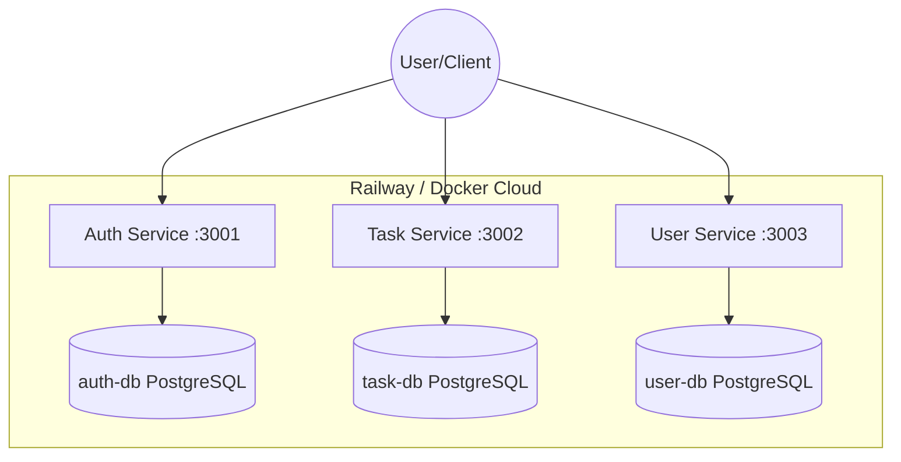

# Final Lab Set 2: Microservices Scale-Up + Cloud Deploy (Railway)

**Student 1:** [Name] [ID]
**Student 2:** [Name] [ID]

## Cloud URLs (Railway)
- **Auth Service:** [AUTH_URL]///
- **Task Service:** [TASK_URL]
- **User Service:** [USER_URL]

## Architecture Overview
This project implements a microservice architecture with the **Database-per-Service** pattern.



### Gateway Strategy
- **Selected:** Option A (Frontend calling individual services directly).
- **Reason:** Simplest to implement for this lab requirement while demonstrating service separation.

## Local Setup
1. Clone the repository.
2. Run `docker-compose up --build`.

## API Endpoints & Testing

### 1. Register User
```bash
curl -X POST http://localhost:3001/api/auth/register \
  -H "Content-Type: application/json" \
  -d '{"username":"testuser","password":"password123","email":"test@example.com"}'
```

### 2. Login (Get JWT)
```bash
curl -X POST http://localhost:3001/api/auth/login \
  -H "Content-Type: application/json" \
  -d '{"username":"testuser","password":"password123"}'
```

### 3. Create Task (requires JWT)
```bash
curl -X POST http://localhost:3002/api/tasks \
  -H "Authorization: Bearer [TOKEN]" \
  -H "Content-Type: application/json" \
  -d '{"title":"Learn Microservices","description":"Complete Final Set 2"}'
```

### 4. Get Profile (requires JWT)
```bash
curl -X GET http://localhost:3003/api/users/profile \
  -H "Authorization: Bearer [TOKEN]"
```