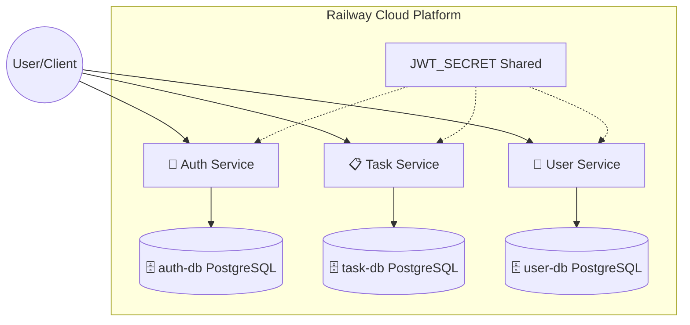

# Final Lab Set 2: Microservices Scale-Up + Cloud Deploy (Railway)

### ข้อมูลนักศึกษา
1. **นายชาคริตส์ แก้วมูลเมือง** | รหัสนักศึกษา: 675432060050
2. **นายพีสิรวิชญ์ ชัยวัชรนนท์** | รหัสนักศึกษา: 675432060688

---

## 🌐 Cloud URLs (Railway)
- **Auth Service:** [https://authservice-production-e242.up.railway.app](https://authservice-production-e242.up.railway.app)
- **Task Service:** [https://taskservice-production-f87d.up.railway.app](https://taskservice-production-f87d.up.railway.app)
- **User Service:** [https://userservice-production-6411.up.railway.app](https://userservice-production-6411.up.railway.app)

---

## 🏗️ Architecture Overview
Cloud version architecture using the **Database-per-Service** pattern.



### Gateway Strategy
- **ที่เลือก:** Option A (Frontend เรียก URL ของแต่ละ service โดยตรง)
- **เหตุผล:** เนื่องจากมีจำนวน Service ไม่มาก การเรียกตรงช่วยลดความซับซ้อนในการ Config และทำให้การจัดการ Environment Variables ของแต่ละ Service บน Railway ทำได้ง่ายขึ้น รวมถึงสอดคล้องกับข้อกำหนดเบื้องต้นของ Lab นี้

---

## 🚀 วิธีการติดตั้งและทดสอบ (Local Setup)
1. Clone Repository นี้
2. รันคำสั่ง Docker:
   ```bash
   docker-compose up --build
   ```

---

## 🧪 วิธีทดสอบ API (Verification)

### 1. Register User
```bash
curl -X POST http://localhost:3001/api/auth/register \
  -H "Content-Type: application/json" \
  -d '{"username":"testuser","password":"password123","email":"test@example.com"}'
```

### 2. Login (รับ JWT Token)
```bash
curl -X POST http://localhost:3001/api/auth/login \
  -H "Content-Type: application/json" \
  -d '{"username":"testuser","password":"password123"}'
```

### 3. Create Task (ต้องใส่ JWT)
```bash
curl -X POST http://localhost:3002/api/tasks \
  -H "Authorization: Bearer [TOKEN_ที่ได้จาก_Login]" \
  -H "Content-Type: application/json" \
  -d '{"title":"Learn Microservices","description":"Complete Final Set 2"}'
```

### 4. Get Profile (ต้องใส่ JWT)
```bash
curl -X GET http://localhost:3003/api/users/profile \
  -H "Authorization: Bearer [TOKEN_ที่ได้จาก_Login]"
```

---

## 🛠️ ปัญหาที่พบและวิธีแก้ไข (Troubleshooting)
1. **ปัญหา:** DATABASE_URL ใน local กับบน Railway ต่างกัน
   - **วิธีแก้:** ใช้ `process.env.DATABASE_URL` ใน `db.js` และรองรับค่า default สำหรับ local (fallback) เพื่อให้ไฟล์เดียวกันทำงานได้ทั้ง 2 สภาพแวดล้อม
2. **ปัญหา:** การแชร์ JWT_SECRET ข้าม 3 Services
   - **วิธีแก้:** กำหนดค่าเดียวกันใน Dashboard ของ Railway ของทั้ง 3 Services เพื่อให้สามารถ Decode Token ข้ามกันได้
3. **ปัญหา:** ตาราง logs ไม่ถูกสร้างหรือ schema ไม่ตรง
   - **วิธีแก้:** ตรวจสอบไฟล์ `init.sql` ของแต่ละ Service ว่ามีโครงสร้างตามที่ Phase 1 กำหนดหรือไม่ และทำการ Mount volume ใน docker-compose ให้ถูกต้อง